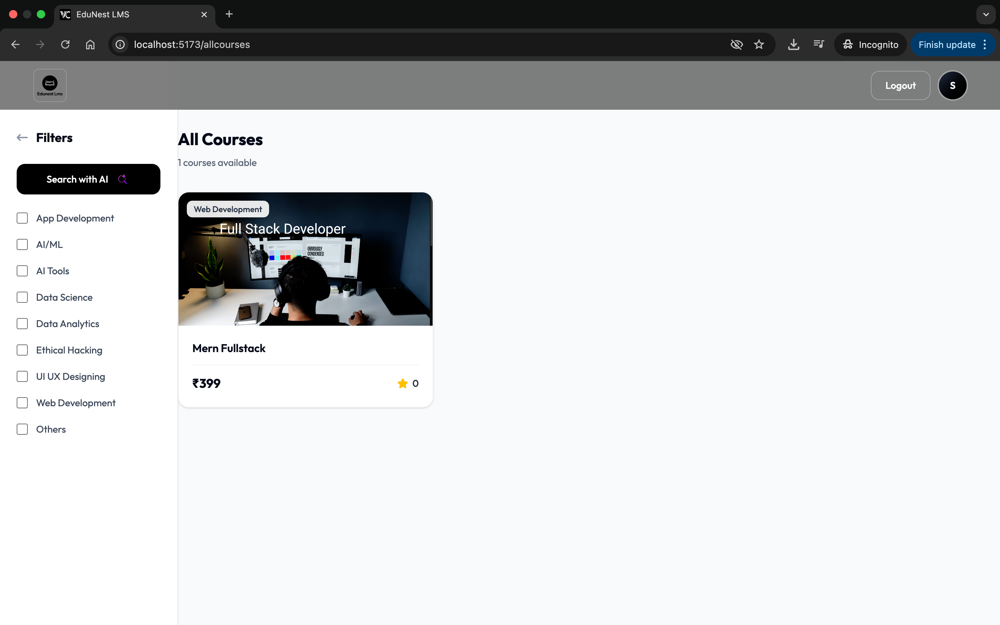
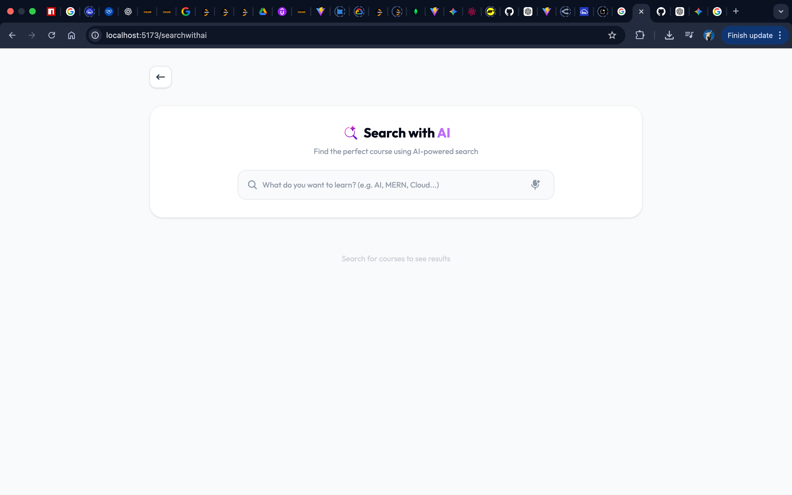
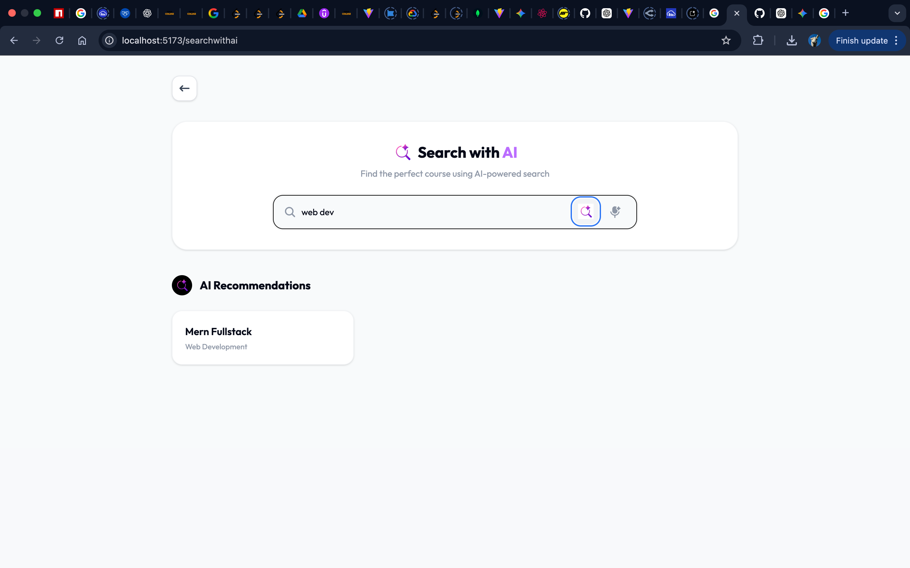
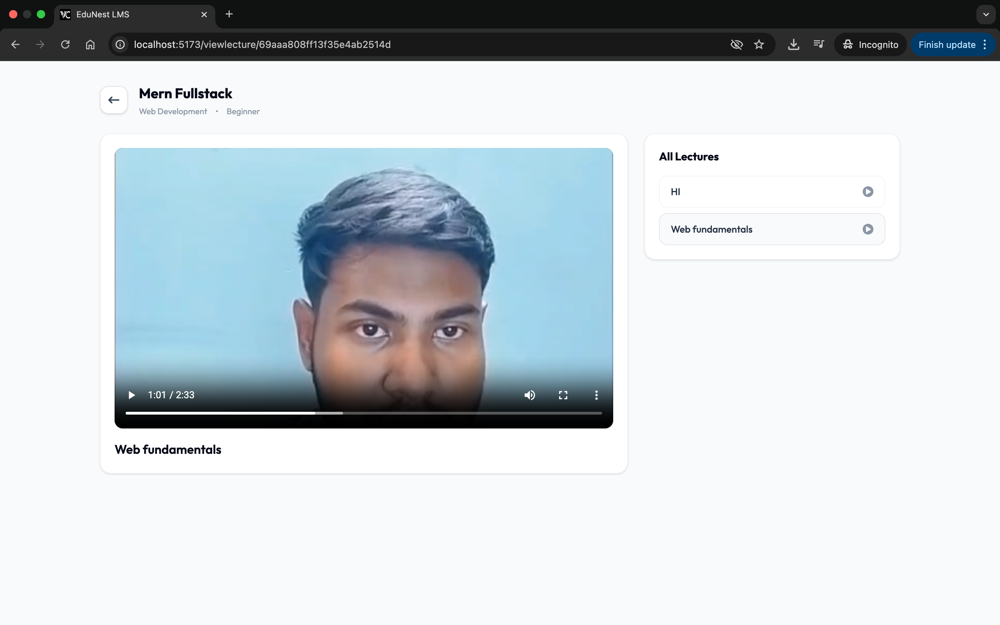
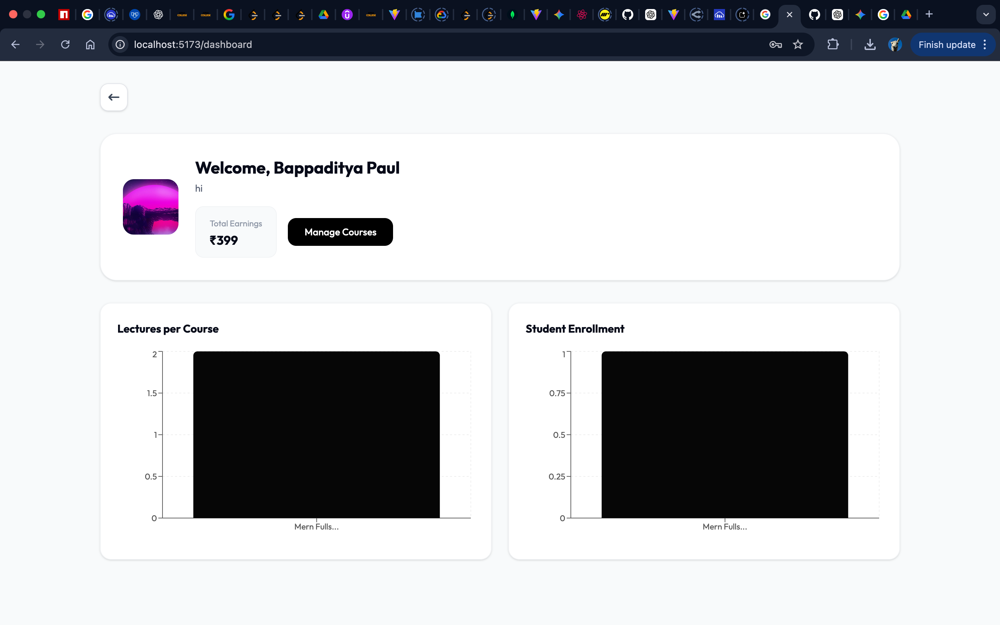
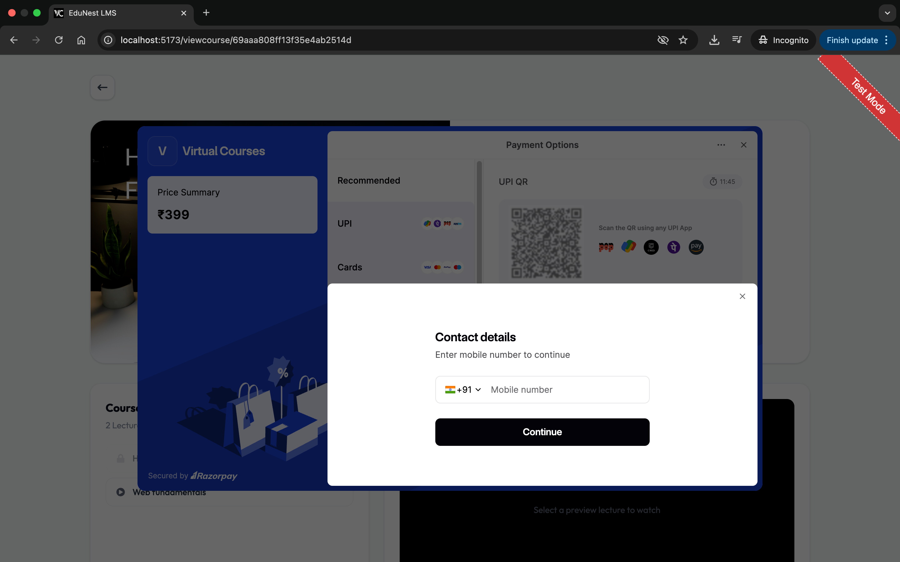

<p align="center">
  
  
  
  
  
  
</p>

# EduNest LMS — Learning Management System

A full-stack **Learning Management System** built with the MERN stack, featuring dual-role authentication (Student & Educator), AI-powered course search via Google Gemini, Razorpay payment integration, and a modern responsive UI powered by Tailwind CSS.

---

## Table of Contents

- [Features](#features)
- [Tech Stack](#tech-stack)
- [Project Structure](#project-structure)
- [Getting Started](#getting-started)
  - [Prerequisites](#prerequisites)
  - [Environment Variables](#environment-variables)
  - [Installation](#installation)
  - [Running the App](#running-the-app)
- [API Reference](#api-reference)
  - [Authentication](#authentication)
  - [User](#user)
  - [Courses](#courses)
  - [Lectures](#lectures)
  - [Payments](#payments)
  - [Reviews](#reviews)
  - [AI Search](#ai-search)
- [Database Schema](#database-schema)
- [Frontend Routes](#frontend-routes)
- [State Management](#state-management)
- [Screenshots](#screenshots)
- [License](#license)

---

## Features

| # | Feature | Description |
|---|---------|-------------|
| 1 | **Dual-Role System** | Users register as **Student** or **Educator** with role-based access control across the entire platform. |
| 2 | **Email & Google OAuth** | Supports traditional email/password authentication and one-click Google sign-in via Firebase. |
| 3 | **Forgot Password with OTP** | Secure password reset flow — OTP sent to email via Nodemailer, verified server-side, then password updated. |
| 4 | **Course Management** | Educators can create, edit, publish, and delete courses with titles, descriptions, categories, levels, and pricing. |
| 5 | **Lecture Management** | Add, edit, and remove lectures with video uploads. Mark individual lectures as free preview. |
| 6 | **Razorpay Payments** | Seamless course purchases with Razorpay — order creation, payment verification, and automatic enrollment. |
| 7 | **Student Enrollment** | Bidirectional enrollment tracking — students see enrolled courses, educators see enrolled student counts. |
| 8 | **Course Reviews** | Students can rate courses (1–5 stars) and leave comments. One review per user per course. |
| 9 | **AI-Powered Search** | Smart course recommendations using **Google Gemini 2.5 Flash** — describe what you want to learn in natural language. |
| 10 | **Educator Dashboard** | Analytics dashboard with revenue charts (Recharts), student counts, and course management tools. |
| 11 | **Cloud Media Hosting** | All images (thumbnails, profile photos) and lecture videos are stored on **Cloudinary** with automatic local cleanup. |
| 12 | **Responsive Modern UI** | Mobile-first design with Tailwind CSS, smooth animations, toast notifications, and loading states. |

---

## Tech Stack

### Backend

| Technology | Purpose |
|------------|---------|
| **Express.js 5.1** | HTTP server & REST API framework |
| **Mongoose / MongoDB** | ODM & NoSQL database |
| **JSON Web Tokens** | Stateless authentication via HTTP-only cookies |
| **bcryptjs** | Password hashing |
| **Multer** | Multipart file upload handling |
| **Cloudinary SDK** | Cloud storage for images & videos |
| **Nodemailer** | Transactional emails (OTP via Gmail SMTP) |
| **Razorpay SDK 2.9** | Payment gateway integration |
| **@google/genai** | Google Gemini AI for smart search |
| **validator** | Input sanitization & validation |
| **cookie-parser** | Cookie parsing middleware |
| **cors** | Cross-origin resource sharing |
| **dotenv** | Environment variable management |

### Frontend

| Technology | Purpose |
|------------|---------|
| **React 19.1** | UI library (functional components + hooks) |
| **Vite 6.3** | Build tool & dev server |
| **Tailwind CSS 4.1** | Utility-first CSS framework |
| **Redux Toolkit** | Global state management |
| **React Router DOM 7.6** | Client-side routing with guards |
| **Axios** | HTTP client |
| **Firebase 11.10** | Google OAuth provider |
| **Recharts** | Data visualization (dashboard charts) |
| **react-toastify** | Toast notifications |
| **react-simple-star-rating** | Star rating component |
| **react-icons** | Icon library |
| **react-spinners** | Loading indicators |

---

## Project Structure

```
LMS/
├── backend/
│   ├── index.js                    # Express server entry point
│   ├── package.json
│   ├── configs/
│   │   ├── cloudinary.js           # Cloudinary upload helper + local file cleanup
│   │   ├── db.js                   # MongoDB connection via Mongoose
│   │   ├── Mail.js                 # Nodemailer Gmail SMTP transporter
│   │   └── token.js                # JWT generation (7-day expiry, HTTP-only cookie)
│   ├── controllers/
│   │   ├── aiController.js         # Gemini AI course search logic
│   │   ├── authController.js       # Signup, login, logout, Google OAuth, OTP flow
│   │   ├── courseController.js      # Course & lecture CRUD operations
│   │   ├── orderController.js      # Razorpay order creation & payment verification
│   │   ├── reviewController.js     # Review creation & retrieval
│   │   └── userController.js       # Profile fetch & update
│   ├── middlewares/
│   │   ├── isAuth.js               # JWT verification middleware (cookie-based)
│   │   └── multer.js               # Disk storage configuration for file uploads
│   ├── models/
│   │   ├── courseModel.js           # Course schema
│   │   ├── lectureModel.js         # Lecture schema
│   │   ├── orderModel.js           # Order schema
│   │   ├── reviewModel.js          # Review schema
│   │   └── userModel.js            # User schema
│   ├── public/                     # Temporary file upload directory
│   └── routes/
│       ├── aiRoute.js              # POST /api/ai/search
│       ├── authRoute.js            # Auth endpoints
│       ├── courseRoute.js           # Course & lecture endpoints
│       ├── paymentRoute.js         # Razorpay payment endpoints
│       ├── reviewRoute.js          # Review endpoints
│       └── userRoute.js            # User profile endpoints
│
├── frontend/
│   ├── index.html                  # HTML entry point
│   ├── vite.config.js              # Vite + Tailwind CSS plugin config
│   ├── package.json
│   └── src/
│       ├── App.jsx                 # Root component with all route definitions
│       ├── App.css                 # Global styles & animations
│       ├── index.css               # Tailwind directives & base styles
│       ├── main.jsx                # React DOM render with Redux Provider & Router
│       ├── components/
│       │   ├── Nav.jsx             # Navigation bar with auth-aware menu
│       │   ├── Footer.jsx          # Site footer
│       │   ├── Card.jsx            # Course card component
│       │   ├── Cardspage.jsx       # Course card grid layout
│       │   ├── VideoPlayer.jsx     # Video player for lectures
│       │   ├── ReviewCard.jsx      # Individual review display
│       │   ├── ReviewPage.jsx      # Reviews section with star ratings
│       │   ├── ExploreCourses.jsx  # Course exploration section
│       │   ├── About.jsx           # About/hero section
│       │   ├── Logos.jsx           # Partner/tech logos display
│       │   └── ScrollToTop.jsx     # Scroll restoration on navigation
│       ├── customHooks/
│       │   ├── getCurrentUser.jsx  # Fetches & dispatches current user data
│       │   ├── getCouseData.jsx    # Fetches & dispatches published courses
│       │   ├── getCreatorCourseData.jsx  # Fetches educator's own courses
│       │   └── getAllReviews.jsx   # Fetches & dispatches all reviews
│       ├── pages/
│       │   ├── Home.jsx            # Landing page
│       │   ├── Login.jsx           # Login form (email + Google OAuth)
│       │   ├── SignUp.jsx          # Registration form with role selection
│       │   ├── ForgotPassword.jsx  # 3-step OTP password reset
│       │   ├── Profile.jsx         # User profile display
│       │   ├── EditProfile.jsx     # Profile editing with photo upload
│       │   ├── AllCouses.jsx       # Browse all published courses
│       │   ├── ViewCourse.jsx      # Course details & enrollment
│       │   ├── EnrolledCourse.jsx  # Student's enrolled courses
│       │   ├── ViewLecture.jsx     # Lecture video player page
│       │   ├── SearchWithAi.jsx    # AI-powered course search
│       │   └── admin/
│       │       ├── Dashboard.jsx   # Educator analytics dashboard
│       │       ├── Courses.jsx     # Educator's course list
│       │       ├── CreateCourse.jsx # New course form
│       │       ├── AddCourses.jsx  # Edit existing course
│       │       ├── CreateLecture.jsx # Add lecture to course
│       │       └── EditLecture.jsx # Edit existing lecture
│       └── redux/
│           ├── store.js            # Redux store configuration
│           ├── userSlice.js        # User state (auth data)
│           ├── courseSlice.js       # Course state
│           ├── lectureSlice.js     # Lecture state
│           └── reviewSlice.js      # Review state
│
└── utils/
    └── Firebase.js                 # Firebase config & Google Auth provider
```

---

## Getting Started

### Prerequisites

- **Node.js** >= 18.x
- **MongoDB** (local instance or [MongoDB Atlas](https://www.mongodb.com/atlas))
- **Razorpay** account ([dashboard.razorpay.com](https://dashboard.razorpay.com))
- **Cloudinary** account ([cloudinary.com](https://cloudinary.com))
- **Firebase** project with Google Auth enabled ([console.firebase.google.com](https://console.firebase.google.com))
- **Google AI Studio** API key for Gemini ([aistudio.google.com](https://aistudio.google.com))

### Environment Variables

#### Backend (`backend/.env`)

```env
PORT=8000
MONGODB_URI=your_mongodb_connection_string

JWT_SECRET=your_jwt_secret_key

CLOUDINARY_CLOUD_NAME=your_cloud_name
CLOUDINARY_API_KEY=your_cloudinary_api_key
CLOUDINARY_API_SECRET=your_cloudinary_api_secret

GMAIL_USER=your_email@gmail.com
GMAIL_APP_PASSWORD=your_gmail_app_password

RAZORPAY_KEY_ID=your_razorpay_key_id
RAZORPAY_KEY_SECRET=your_razorpay_key_secret

GEMINI_API_KEY=your_gemini_api_key
```

#### Frontend (`frontend/.env`)

```env
VITE_RAZORPAY_KEY_ID=your_razorpay_key_id

VITE_FIREBASE_API_KEY=your_firebase_api_key
VITE_FIREBASE_AUTH_DOMAIN=your_project.firebaseapp.com
VITE_FIREBASE_PROJECT_ID=your_firebase_project_id
VITE_FIREBASE_STORAGE_BUCKET=your_project.firebasestorage.app
VITE_FIREBASE_MESSAGING_SENDER_ID=your_messaging_sender_id
VITE_FIREBASE_APP_ID=your_firebase_app_id
```

### Installation

```bash
# Clone the repository
git clone https://github.com/your-username/edunest-lms.git
cd edunest-lms

# Install backend dependencies
cd backend
npm install

# Install frontend dependencies
cd ../frontend
npm install
```

### Running the App

```bash
# Terminal 1 — Start the backend server (port 8000)
cd backend
npm run dev

# Terminal 2 — Start the frontend dev server (port 5173)
cd frontend
npm run dev
```

Open [http://localhost:5173](http://localhost:5173) in your browser.

---

## API Reference

> Base URL: `http://localhost:8000/api`

### Authentication

| Method | Endpoint | Auth | Description |
|--------|----------|------|-------------|
| `POST` | `/auth/signup` | No | Register with name, email, password, role |
| `POST` | `/auth/login` | No | Login with email & password |
| `POST` | `/auth/googlesignup` | No | Google OAuth sign-in via Firebase token |
| `GET` | `/auth/logout` | No | Clear auth cookie |
| `POST` | `/auth/sendotp` | No | Send OTP to email for password reset |
| `POST` | `/auth/verifyotp` | No | Verify OTP code |
| `POST` | `/auth/resetpassword` | No | Reset password after OTP verification |

### User

| Method | Endpoint | Auth | Description |
|--------|----------|------|-------------|
| `GET` | `/user/currentuser` | Yes | Get authenticated user's profile |
| `POST` | `/user/updateprofile` | Yes | Update profile (name, description, photo) |

### Courses

| Method | Endpoint | Auth | Description |
|--------|----------|------|-------------|
| `POST` | `/course/create` | Yes | Create a new course (educator only) |
| `GET` | `/course/getpublishedcoures` | No | List all published courses |
| `GET` | `/course/getcreatorcourses` | Yes | List educator's own courses |
| `POST` | `/course/editcourse/:id` | Yes | Edit course details (multipart) |
| `GET` | `/course/getcourse/:id` | Yes | Get single course with populated data |
| `DELETE` | `/course/removecourse/:id` | Yes | Delete a course |
| `GET` | `/course/getcreator` | No | List all educators |

### Lectures

| Method | Endpoint | Auth | Description |
|--------|----------|------|-------------|
| `POST` | `/course/createlecture/:id` | Yes | Add lecture to course (video upload) |
| `GET` | `/course/getcourselecture/:id` | Yes | List all lectures for a course |
| `POST` | `/course/editlecture/:id` | Yes | Edit lecture (video + metadata) |
| `DELETE` | `/course/removelecture/:id` | Yes | Delete a lecture |

### Payments

| Method | Endpoint | Auth | Description |
|--------|----------|------|-------------|
| `POST` | `/payment/create-order` | Yes | Create Razorpay order for a course |
| `POST` | `/payment/verify-payment` | Yes | Verify payment signature & enroll student |

### Reviews

| Method | Endpoint | Auth | Description |
|--------|----------|------|-------------|
| `POST` | `/review/givereview` | Yes | Submit a course review (rating + comment) |
| `GET` | `/review/allReview` | No | Fetch all reviews |

### AI Search

| Method | Endpoint | Auth | Description |
|--------|----------|------|-------------|
| `POST` | `/ai/search` | No | AI-powered course search using Gemini 2.5 Flash |

---

## Database Schema

### User

| Field | Type | Details |
|-------|------|---------|
| `name` | String | Required |
| `email` | String | Required, unique |
| `password` | String | Required (hashed with bcryptjs) |
| `description` | String | Optional bio |
| `role` | String | `"educator"` or `"student"` (default) |
| `photoUrl` | String | Profile photo URL (Cloudinary) |
| `enrolledCourses` | ObjectId[] | References → Course |
| `resetOtp` | String | OTP for password reset |
| `otpExpires` | Date | OTP expiration timestamp |
| `isOtpVerifed` | Boolean | OTP verification status |

### Course

| Field | Type | Details |
|-------|------|---------|
| `title` | String | Required |
| `subTitle` | String | — |
| `description` | String | — |
| `category` | String | e.g., "Web Development", "AI/ML" |
| `level` | String | `"Beginner"` / `"Intermediate"` / `"Advanced"` |
| `price` | Number | In INR |
| `thumbnail` | String | Cloudinary URL |
| `enrolledStudents` | ObjectId[] | References → User |
| `lectures` | ObjectId[] | References → Lecture |
| `creator` | ObjectId | Reference → User |
| `isPublished` | Boolean | Default `false` |
| `reviews` | ObjectId[] | References → Review |

### Lecture

| Field | Type | Details |
|-------|------|---------|
| `lectureTitle` | String | Required |
| `videoUrl` | String | Cloudinary video URL |
| `isPreviewFree` | Boolean | Default `false` |

### Order

| Field | Type | Details |
|-------|------|---------|
| `course` | ObjectId | Reference → Course |
| `student` | ObjectId | Reference → User |
| `razorpay_order_id` | String | Razorpay order identifier |
| `razorpay_payment_id` | String | Razorpay payment identifier |
| `razorpay_signature` | String | Payment verification signature |
| `amount` | Number | Payment amount |
| `currency` | String | Default `"INR"` |
| `isPaid` | Boolean | Default `false` |
| `paidAt` | Date | Payment timestamp |

### Review

| Field | Type | Details |
|-------|------|---------|
| `course` | ObjectId | Reference → Course |
| `user` | ObjectId | Reference → User |
| `rating` | Number | 1–5, required |
| `comment` | String | Optional |
| `reviewedAt` | Date | Default `Date.now` |

---

## Frontend Routes

### Public Routes

| Path | Page | Description |
|------|------|-------------|
| `/` | Home | Landing page with hero, courses, reviews |
| `/login` | Login | Email/password & Google sign-in |
| `/signup` | SignUp | Registration with role selection |
| `/forgotpassword` | ForgotPassword | 3-step OTP password reset |

### Authenticated Routes (Redirect to `/signup` if not logged in)

| Path | Page | Description |
|------|------|-------------|
| `/profile` | Profile | View user profile & enrolled courses |
| `/editprofile` | EditProfile | Update name, bio, profile photo |
| `/allcourses` | AllCourses | Browse all published courses |
| `/viewcourse/:courseId` | ViewCourse | Course details, lectures, reviews, enrollment |
| `/enrolledcourses` | EnrolledCourse | Student's enrolled courses |
| `/viewlecture/:courseId` | ViewLecture | Lecture video player |
| `/searchwithai` | SearchWithAi | AI-powered course recommendations |

### Educator-Only Routes (Redirect to `/signup` if not educator)

| Path | Page | Description |
|------|------|-------------|
| `/dashboard` | Dashboard | Revenue analytics & student stats |
| `/courses` | Courses | Manage created courses |
| `/createcourses` | CreateCourse | Create a new course |
| `/addcourses/:courseId` | AddCourses | Edit course details & settings |
| `/createlecture/:courseId` | CreateLecture | Add lecture with video upload |
| `/editlecture/:courseId/:lectureId` | EditLecture | Edit lecture content |

---

## State Management

The app uses **Redux Toolkit** with four slices:

```
store
├── user       →  { userData: null }                    # Current authenticated user
├── course     →  { creatorCourseData: [],              # Educator's courses
│                    courseData: [],                     # All published courses
│                    selectedCourseData: null }          # Currently viewed course
├── lecture    →  { lectureData: [] }                   # Lectures for current course
└── review     →  { allReview: [] }                     # All platform reviews
```

**Custom Hooks** automatically dispatch data on app mount:
- `getCurrentUser` — Fetches and stores the logged-in user
- `getCouseData` — Fetches all published courses
- `getCreatorCourseData` — Fetches educator's courses (if authenticated)
- `getAllReviews` — Fetches all reviews

---

## Screenshots

<p align="center">
  
</p>

|  |  |
|:---:|:---:|
|  |  |
|  |  |
|  |  |

---

## Contributing

1. Fork the repository
2. Create a feature branch (`git checkout -b feature/amazing-feature`)
3. Commit changes (`git commit -m 'Add amazing feature'`)
4. Push to branch (`git push origin feature/amazing-feature`)
5. Open a Pull Request

---

<!-- ## License

This project is open source and available under the [MIT License](LICENSE). -->

---

<p align="center">
  Built with dedication by <strong>Sanjoy Deb</strong>
</p>